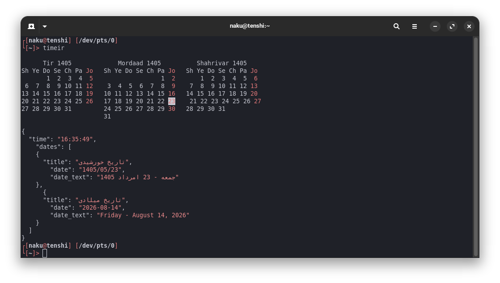

# timeir




A simple CLI tool that displays the current time and date in both **Jalali (Persian)** and **Gregorian** calendars, along with a 3-month Jalali calendar view.

## Features

- Current time (HH:MM:SS)
- Dual calendar display:
  - Jalali (Persian) date with Persian month/day names
  - Gregorian date with English month/day names
- 3-month Jalali calendar view (previous, current, next month)
- Colorized terminal output (Cyan for calendar, Red for JSON values)

## Screenshots

```
<output showing cyan calendar + red JSON values>
```

## Requirements

- Python 3.6+
- `jdatetime` - Jalali datetime library
- `jalali_core` - Core Jalali calendar calculations
- `jcal` command-line tool (from `libjalali` package)

## Installation

Run the install script — it installs Python requirements, `jcal`, and adds `timeir` to your `~/.local/bin`:

```bash
./install.sh
```

Make sure `~/.local/bin` is in your PATH, then run:

```bash
timeir
```


## Project Structure

```
timeir/
├── timeir.py       # Main script
├── requirements.txt # Python dependencies
├── install.sh      # Installation helper script
��── README.md       # This file
```

## How It Works

1. **Calendar display**: Uses `jcal -3` subprocess to render a 3-month Jalali calendar
2. **Time/Date**: Gets current time via Python's `datetime`, converts to Jalali via `jdatetime`
3. **Colorization**: Custom JSON formatter that wraps all values in ANSI red color codes while keeping keys uncolored


created by:**nakutenshi**
